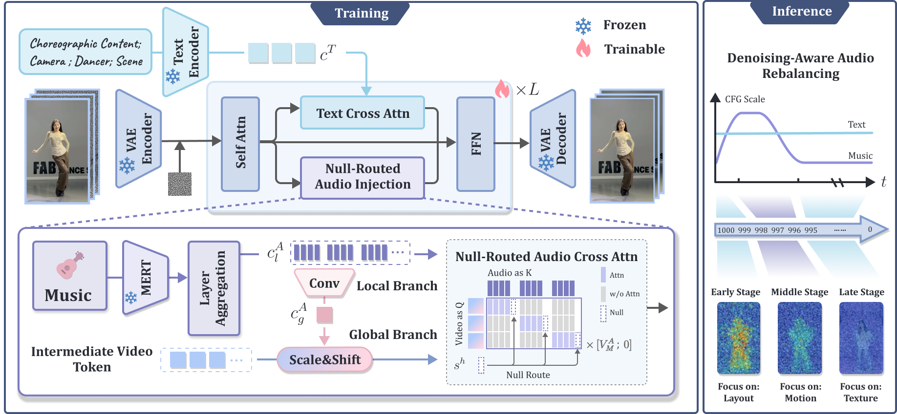

# RoDA-Dance

**Routed and Denoising-Aware Music Conditioning for Dance Video Generation**

RoDA-Dance is a music-driven dance video generation framework for improving music-motion coordination, motion diversity, and motion quality while maintaining visual fidelity, subject consistency, and temporal stability. The project focuses on effective modeling and coordination of music conditioning in diffusion-based video generation.

Project page: [https://minervaw26.github.io/RoDA-Dance/](https://minervaw26.github.io/RoDA-Dance/)

## Overview

Music-driven dance video generation requires models to follow semantic instructions, respond to musical dynamics, and preserve visual fidelity. Existing end-to-end methods are limited by local music modeling, strong audio-motion binding, and imbalanced text-music conditioning across denoising stages.

RoDA-Dance addresses these challenges with:

- **Global-Local Music Conditioning** for combining local rhythmic cues with segment-level musical context.
- **Null-Routed Audio Cross-Attention** for controlling audio attention strength while preserving the relative distribution among real audio tokens.
- **Denoising-Aware Audio Rebalancing** for coordinating text and music guidance across denoising stages.

## Method Pipeline



## Citation

```bibtex
@inproceedings{wang2026roda,
  title={RoDA-Dance: Routed and Denoising-Aware Music Conditioning for Dance Video Generation},
  author={Meng Wang, Zichao Nie, Xu He, Liyang Chen, Haiwei Xue, Runnan Li and Zhiyong Wu},
  booktitle={ICASSP},
  year={2027}
}
```
